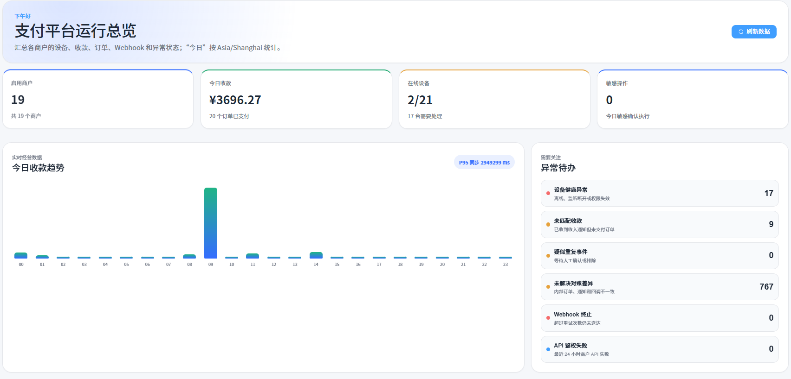
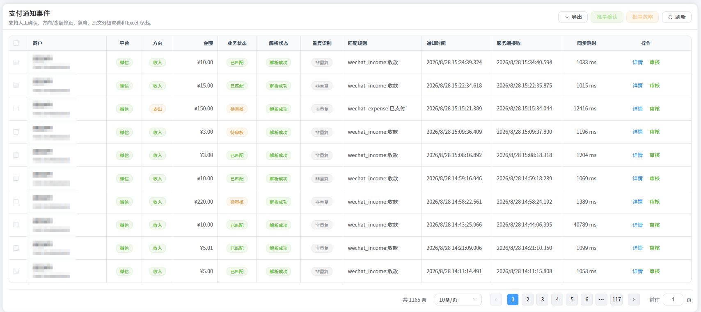
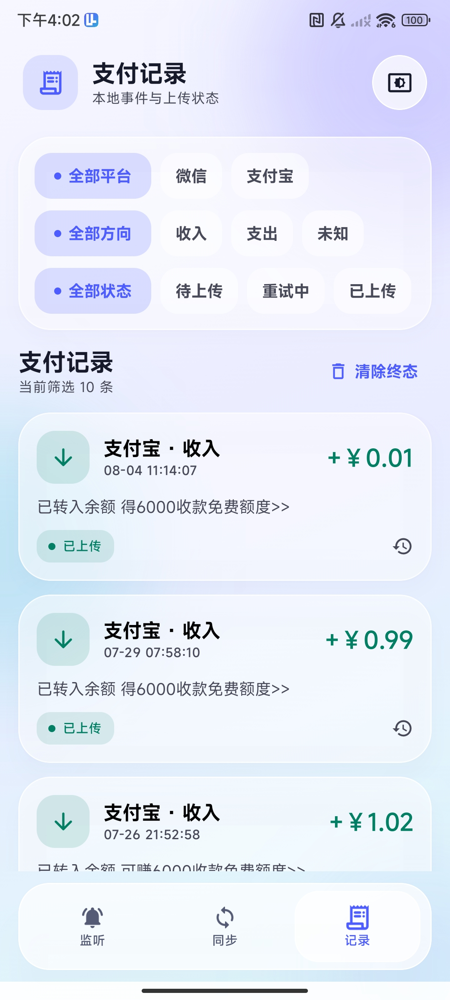

# LuLuPay - 码支付监控系统

> 面向个人 / 小微收款的**码支付（收款码）监控与管理平台**：Android 端实时监听微信 / 支付宝收款通知并自动上报，服务端集中管理商户、订单、交易与对账，内置告警通知、消息中心、多因素认证等安全能力。

> 🌐 **在线体验**：[https://pay.luluapi.cc.cd/](https://pay.luluapi.cc.cd/)

[](LICENSE)
[](https://github.com/xhulong/payment-monitor)
[](https://github.com/xhulong/payment-monitor)
[]()
[]()
[]()
[]()
[]()

> ⭐ **如果这个项目对你有帮助，请给我们点个 Star 支持一下**，你的支持是我们持续维护的动力！

---

## 界面预览

| 管理后台 - 数据仪表盘 | 支付事件监控 | Android 收款通知 |
| :---: | :---: | :---: |
|  |  |  |

---

## 功能特性

### 📱 移动端通知监听（Android）
- 监听微信 `com.tencent.mm` 与支付宝 `com.eg.android.AlipayGphone` 的支付候选通知
- 解析标题、正文、BigText、TextLines、Ticker、SubText 等全部通知字段，区分**收入 / 支出 / 方向待确认**事件并提取人民币金额
- Room 本地存储 + 自动上传队列，断网不丢单；WorkManager 定时 / 网络变更触发同步
- Android Keystore 加密设备凭据，设备与服务端绑定

### 🧾 商户与订单管理
- 商户入驻申请、审核、邀请与成员管理
- 收款码（二维码）资产管理、商户公开页
- 支付事件、订单、交易流水、**自动对账（reconciliation）**与调账审核
- 收款通知回调（webhook）投递：出站邮箱（outbox）模式，失败自动重试

### 🔔 告警与消息中心
- 告警规则引擎：收入 / 支出事件触发规则并推送通知
- 消息中心：站内信 + 邮件 + Webhook，SSE / WebSocket 实时推送
- 邮件发送中心：邮件配置管理、发送记录、失败重试

### 🛡 安全能力
- 账号 **MFA 多因素认证**（TOTP，登录二次验证 + 敏感操作再次验证）
- 应用层 **API 加密 v2**（RSA + AES 混合加密协议，按接口显式启用）
- 敏感操作审计、账号恢复码、设备绑定

### 🏗 平台底座（继承 RuoYi-Vue-Plus）
- 用户 / 角色 / 菜单 / 部门权限，操作日志、登录日志、在线用户
- 工作流（FlowLong）、分布式任务调度（SnailJob）、代码生成、文件存储（MinIO / OSS）
- 支付 App 发布管理（APK 下载页）

## 项目结构

```
payment/
├── payment-monitor-server/          # 后端服务（Java 21 + Spring Boot 4）
│   ├── ruoyi-admin/                 # 启动模块（Web 入口）
│   ├── ruoyi-modules/               # 业务模块
│   │   ├── ruoyi-payment/           # 支付监控核心业务（商户/订单/对账/告警/MFA/邮件）
│   │   ├── ruoyi-system/            # 系统管理
│   │   ├── ruoyi-workflow/          # 工作流
│   │   └── ...
│   ├── ruoyi-common/                # 公共组件（核心/加密/推送/邮件/OSS 等）
│   ├── ruoyi-extend/                # 扩展服务（Admin 监控 / SnailJob 调度中心）
│   ├── deploy/                      # Docker 编排与部署配置
│   └── script/sql/                  # 数据库初始化脚本（MySQL / PostgreSQL / Oracle / SQLServer）
├── payment-monitor-admin/           # 管理后台前端（Vue3 + TS + Element Plus + Vite）
└── payment-notification-monitor/    # Android 通知监听客户端（Kotlin + Jetpack Compose）
```

## 技术栈

| 端 | 技术 |
| --- | --- |
| 后端 | Java 21 · Spring Boot 4.1 · RuoYi-Vue-Plus 6.x · Sa-Token · MyBatis-Plus · FlowLong 工作流 · SnailJob 调度 |
| 数据库 | PostgreSQL 17（主推，附 MySQL / Oracle / SQLServer 脚本）· Redis · MinIO |
| 管理后台 | Vue 3.5 · TypeScript · Element Plus 2.14 · Vite · Pinia |
| 移动端 | Kotlin · Jetpack Compose · Room · WorkManager · Retrofit/OkHttp · Android Keystore |

## 快速开始

### 方式一：Docker Compose（推荐）

```bash
# 1. 克隆仓库
git clone https://github.com/xhulong/payment-monitor.git
cd payment-monitor/payment-monitor-server

# 2. 准备环境变量（参考 deploy/.env.ports.example）
cp deploy/.env.ports.example deploy/.env

# 3. 启动依赖（PostgreSQL + Redis + MinIO + SnailJob）
docker compose -f deploy/docker-compose.local.yml up -d postgres redis minio snailjob-server

# 4. 构建并启动后端与前端
cd ../payment-monitor-admin && pnpm install && pnpm build:prod
cd ../payment-monitor-server
docker compose -f deploy/docker-compose.local.yml up -d --build backend admin
```

- 管理后台：http://localhost （默认账号 `admin` / `admin123`，首次登录请修改）
- 后端接口：http://localhost:8080

> 详细步骤、环境变量清单与生产部署（HTTPS / 反向代理 / 监控告警）见 **[部署教程](docs/DEPLOYMENT.md)**。

### 方式二：源码运行

**后端**

```bash
cd payment-monitor-server
# 需要 JDK 21 与 Maven 3.9+
mvn -pl ruoyi-admin -am package -DskipTests
cd ruoyi-admin
# 环境变量见 .env.example（数据库 / Redis 等）
DB_PASSWORD=xxx REDIS_PASSWORD=xxx SA_TOKEN_JWT_SECRET=xxx \
  java -jar target/ruoyi-admin.jar --spring.profiles.active=dev
```

**前端**

```bash
cd payment-monitor-admin
pnpm install
pnpm dev        # http://localhost:5173（代理 /dev-api 到后端）
pnpm build:prod # 生产构建
```

**Android 端**

```bash
cd payment-notification-monitor
# 配置服务端地址后，用 Android Studio 打开并运行
```

## 数据库初始化

首次启动时按顺序完成：

1. **基础库初始化**：执行 `script/sql/` 下对应数据库方言的脚本（`ry_vue.sql` / `ry_job.sql` / `ry_workflow.sql`），或直接使用 Docker Compose（镜像首次启动自动执行 `script/sql/postgres/` 下的脚本）；
2. **支付业务表**：由后端应用启动时的 **Flyway 自动迁移**创建（`ruoyi-modules/ruoyi-payment/src/main/resources/db/migration/payment/`，表前缀 `pm_`），无需手工执行。

> 详见 [数据库初始化说明](docs/DEPLOYMENT.md#数据库初始化)。

## 文档

- [部署教程（含生产环境）](docs/DEPLOYMENT.md)

## 致谢

- 后端基座：[RuoYi-Vue-Plus](https://gitee.com/dromara/RuoYi-Vue-Plus)（MIT）
- 前端基座：[plus-ui](https://gitee.com/JavaLionLi/plus-ui)（MIT）
- 工作流：[FlowLong](https://gitee.com/aizuda/flowlong) · 任务调度：[SnailJob](https://gitee.com/aizuda/snail-job)

## License

本项目基于 [MIT License](LICENSE) 开源，可免费商用，请在项目中保留开源协议文件。

---

## ⭐ Star History

如果 LuLuPay 对你有帮助，欢迎点个 Star，你的支持是我们持续维护的动力！

[](https://star-history.com/#xhulong/payment-monitor&Date)
