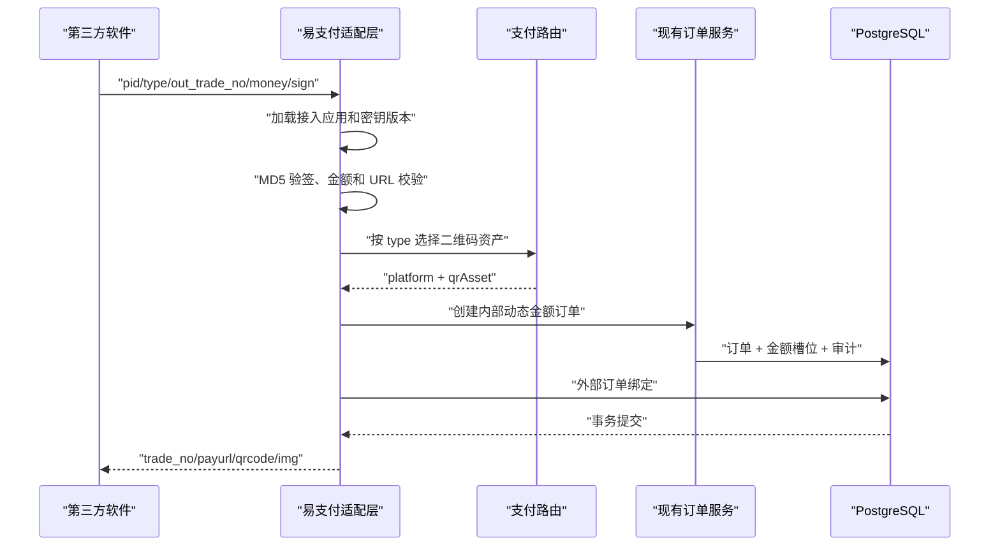

# 易支付兼容接入设计

## 1. 设计结论

当前系统不应把现有 `/api/v1/merchant/**` 改造成易支付接口，而应新增一个独立的
“易支付兼容适配层”：

```text
市面上的商城/发卡/建站软件
        │
        │ 易支付表单、MD5 签名、submit.php/mapi.php/api.php
        ▼
EasyPay Compatibility Adapter
        │
        │ 统一内部命令
        ▼
现有订单、动态金额、二维码、支付事件、到账匹配、交易、对账
        │
        ├── 现有 JSON Webhook（保持不变）
        └── 易支付异步通知 Outbox（新增）
```

原因：

1. 当前商户 API 使用请求头、时间戳、Nonce 和 HMAC-SHA256；易支付通常使用表单或
   Query 参数以及 MD5 签名，两套安全模型不能混用。
2. 当前订单 API 要求调用方传入 `qrAssetCode`；易支付调用方通常只传 `type`，
   二维码路由必须由服务端自动完成。
3. 当前 Webhook 是 JSON POST，任意 `2xx` 即成功；易支付通知通常是表单/Query
   参数，并要求响应正文严格等于 `success`。
4. 易支付订单需要保存每单 `notify_url`、`return_url`、`param`、外部订单号和
   协议凭据版本，这些字段不适合直接塞进现有核心订单表。

因此建议采用：

> **核心支付域保持协议无关，易支付作为 Anti-Corruption Layer（防腐层）接入。**

---

## 2. 当前系统可以直接复用的能力

| 当前能力 | 复用方式 |
| --- | --- |
| 多商户隔离 | 易支付 `pid` 映射到一个商户下的一个“接入应用” |
| 商户生命周期 | 只有 `ACTIVE` 商户可以发起易支付订单 |
| 二维码资产 | `type` 经路由规则自动选择 `pm_qr_asset` |
| 动态金额 | 易支付原金额写入 `requested_amount_minor`，实际支付金额继续使用 `payable_amount_minor` |
| 金额槽位 | 继续避免相同商户、渠道和金额的并发冲突 |
| 公开支付页 | `payurl` 指向现有 `/pay/{publicToken}` |
| 通知监听和到账匹配 | 完全复用，不在易支付适配层重复实现 |
| 交易与确认 | 继续由 `pm_payment_transaction` 承载 |
| Outbox 和重试经验 | 复用重试、锁、日志、SSRF 防护的公共组件 |
| 对账与人工处理 | 易支付订单仍进入现有订单、交易、对账体系 |

当前最重要的适配点是：

```text
EasyPay request
  -> 验签
  -> type 路由
  -> 创建内部订单
  -> 返回 EasyPay response

内部订单 PAID
  -> 生成 EasyPay notify 参数
  -> 使用“下单时的密钥版本”签名
  -> 可靠投递 notify_url
```

---

## 3. 兼容范围

### 3.1 第一阶段必须支持

| 能力 | 推荐入口 |
| --- | --- |
| 页面支付 | `GET/POST /submit.php` |
| API 下单 | `POST /mapi.php` |
| 订单查询 | `GET/POST /api.php?act=order` |
| 异步通知 | 服务端投递商户 `notify_url` |
| 同步跳转 | 支付成功后跳转商户 `return_url` |
| 支付类型 | `alipay`、`wxpay` |
| 签名 | 易支付常见 MD5 参数签名 |
| 回调成功确认 | 响应正文去除首尾空白后严格等于 `success` |

建议同时提供以下路径别名，以适应不同软件对“易支付地址”的拼接方式：

```text
/submit.php
/mapi.php
/api.php

/pay/submit.php
/pay/mapi.php
/pay/api.php

/epay/submit.php
/epay/mapi.php
/epay/api.php
```

所有别名进入同一个 Controller/Facade，不复制业务代码。

### 3.2 后续按兼容测试增加

- `act=balance`
- `act=query`
- 不同查询响应字段
- `wechat`、`weixin` 等 `wxpay` 别名
- POST 异步通知
- HMAC-MD5、SHA256 等厂商方言
- `qqpay`、`bank` 等新增渠道
- `urlscheme`、小程序跳转参数

退款不建议伪装实现。当前系统没有官方渠道退款和资金原路退回能力，在兼容接口中应返回明确的
“该能力未启用”结果，不能只修改本地订单状态冒充退款完成。

---

## 4. 协议基线

### 4.1 下单参数

基线字段：

| 字段 | 必填 | 内部映射 |
| --- | --- | --- |
| `pid` | 是 | `pm_payment_integration.pid` |
| `type` | 是 | `alipay -> ALIPAY`，`wxpay -> WECHAT` |
| `out_trade_no` | 是 | 外部订单号，保存在绑定表 |
| `notify_url` | 是 | 易支付异步通知目标 |
| `return_url` | 否 | 浏览器支付成功跳转目标 |
| `name` | 是 | `subject` |
| `money` | 是 | 精确转换为 `requested_amount_minor` |
| `param` | 否 | 透传参数 |
| `sign` | 是 | 请求签名 |
| `sign_type` | 是 | 第一阶段仅接受 `MD5` |
| `device` | 否 | 作为支付页展示/跳转策略参考 |
| `clientip` | 否 | 记录但不信任，由可信代理解析的服务端 IP 优先 |

金额转换必须使用：

```java
BigDecimal yuan = new BigDecimal(money);
long amountMinor = yuan.setScale(2, RoundingMode.UNNECESSARY)
    .movePointRight(2)
    .longValueExact();
```

禁止使用 `double`。

### 4.2 签名规则

基线算法：

1. 删除 `sign` 和 `sign_type`。
2. 删除值为 `null` 或空字符串的参数。
3. 按参数名 ASCII 升序排列。
4. 拼成 `key=value&key2=value2`。
5. 在末尾直接追加商户密钥。
6. 对 UTF-8 字节计算 MD5，输出小写十六进制。

示意：

```text
name=测试商品&money=10.00&notify_url=...&out_trade_no=...&pid=10001&type=alipay
```

签名原文：

```text
name=测试商品&money=10.00&notify_url=...&out_trade_no=...&pid=10001&type=alipay{merchantKey}
```

实现时必须固定：

- UTF-8；
- 参数名排序规则；
- 空值过滤规则；
- `money` 原始字符串格式；
- URL 编码发生在签名之后，签名使用解码后的参数值；
- 常量时间比较签名结果。

### 4.3 MAPI 成功响应

建议返回兼容字段的超集：

```json
{
  "code": 1,
  "msg": "success",
  "trade_no": "202607201234567890123456",
  "payurl": "https://pay.example.com/pay/TOKEN",
  "qrcode": "QR_CONTENT",
  "img": "https://pay.example.com/api/public/payment-orders/TOKEN/qr.svg",
  "urlscheme": ""
}
```

注意：

- `trade_no` 是本系统生成的易支付网关订单号，不直接暴露数据库主键。
- `payurl` 是完整支付页面。
- `qrcode` 返回二维码原始内容。
- `img` 返回二维码图片 URL。
- `urlscheme` 没有可用值时返回空字符串，避免字段缺失导致部分客户端报错。

失败响应：

```json
{
  "code": -1,
  "msg": "签名校验失败"
}
```

### 4.4 页面支付

`submit.php` 完成验签和创建订单后：

```http
HTTP/1.1 302 Found
Location: /pay/{publicToken}
Cache-Control: no-store
```

失败时返回 UTF-8 的简洁错误页，并使用合适的 `4xx` 状态码。

### 4.5 查询响应

建议至少支持：

```json
{
  "code": 1,
  "msg": "查询订单号成功",
  "trade_no": "202607201234567890123456",
  "out_trade_no": "SHOP_ORDER_10001",
  "type": "alipay",
  "pid": "10001",
  "addtime": "2026-07-20 12:34:56",
  "endtime": "2026-07-20 12:35:20",
  "name": "测试商品",
  "money": "10.00",
  "status": 1
}
```

状态映射：

| 内部状态 | 易支付查询 `status` |
| --- | --- |
| `PENDING` | `0` |
| `PAID` | `1` |
| `EXPIRED` | `0` |
| `CANCELLED` | `0` |
| `CONFLICT` | `0`，同时在管理端提示人工处理 |

为了最大兼容，查询和回调的 `money` 应返回原始下单金额
`requested_amount_minor`，而不是动态加价后的 `payable_amount_minor`。

原因是接入方的软件通常会将回调金额与自己的订单金额严格比较。实际扫码金额仍由支付页展示
`payable_amount_minor`，内部对账同时保留两个金额。

### 4.6 异步通知

支付完成时发送：

```text
pid
trade_no
out_trade_no
type
name
money
trade_status=TRADE_SUCCESS
param（原请求存在时才发送）
sign
sign_type=MD5
```

推荐默认使用 GET，另允许接入应用配置为 POST Form。

通知签名必须使用：

> **创建该订单时使用的凭据版本**

不能简单使用当前最新密钥，否则密钥轮换后，旧订单的异步通知会验签失败。

通知成功条件：

```text
HTTP 2xx
并且
trim(responseBody) == "success"
```

仅返回 HTTP 200 但正文不是 `success`，仍应重试。

---

## 5. 数据模型

### 5.1 接入应用

```sql
create table pm_payment_integration
(
    id                      bigint primary key,
    merchant_id             bigint not null references pm_merchant(id),
    integration_code        varchar(64) not null,
    integration_name        varchar(100) not null,
    protocol                varchar(24) not null default 'EPAY',
    profile                 varchar(32) not null default 'EPAY_CLASSIC_V1',
    pid                     varchar(32) not null,
    status                  char(1) not null default '0',
    default_expire_seconds  integer not null default 300,
    notify_method           varchar(8) not null default 'GET',
    allowed_callback_hosts  varchar(2000),
    remark                  varchar(500),
    created_by              bigint,
    created_at              timestamptz not null,
    updated_at              timestamptz not null,
    unique (pid),
    unique (merchant_id, integration_code)
);
```

`pid` 建议生成为纯数字字符串。部分旧插件会把它当数字处理。

### 5.2 接入密钥版本

```sql
create table pm_payment_integration_secret
(
    id                  bigint primary key,
    integration_id      bigint not null references pm_payment_integration(id),
    secret_version      integer not null,
    secret_ciphertext   varchar(1024) not null,
    status              varchar(16) not null,
    activated_at        timestamptz not null,
    retired_at          timestamptz,
    created_at          timestamptz not null,
    unique (integration_id, secret_version)
);
```

状态建议：

```text
ACTIVE
RETIRED
REVOKED
```

`RETIRED` 密钥仍可用于历史订单回调签名；`REVOKED` 立即停止使用。

### 5.3 支付类型路由

```sql
create table pm_payment_integration_route
(
    id                  bigint primary key,
    integration_id      bigint not null references pm_payment_integration(id),
    pay_type            varchar(32) not null,
    platform            varchar(16) not null,
    qr_asset_id         bigint not null references pm_qr_asset(id),
    priority            integer not null default 100,
    status              char(1) not null default '0',
    created_at          timestamptz not null,
    updated_at          timestamptz not null,
    unique (integration_id, pay_type, qr_asset_id)
);
```

第一阶段：

```text
alipay -> ALIPAY -> 指定支付宝二维码资产
wxpay  -> WECHAT -> 指定微信二维码资产
```

服务端选择路由时必须再次校验：

- 二维码属于同一商户；
- 二维码平台与路由一致；
- 二维码处于启用状态；
- 对应监控设备处于可用状态时优先。

### 5.4 外部订单绑定

```sql
create table pm_external_order_binding
(
    id                       bigint primary key,
    merchant_id              bigint not null references pm_merchant(id),
    integration_id           bigint not null references pm_payment_integration(id),
    order_id                 bigint not null references pm_payment_order(id),
    protocol                 varchar(24) not null,
    external_order_no        varchar(64) not null,
    gateway_trade_no         varchar(64) not null,
    pay_type                 varchar(32) not null,
    request_amount_minor     bigint not null,
    notify_url               varchar(1000) not null,
    return_url               varchar(1000),
    passthrough_param        varchar(500),
    credential_version       integer not null,
    request_snapshot         jsonb not null default '{}'::jsonb,
    created_at               timestamptz not null,
    updated_at               timestamptz not null,
    unique (integration_id, external_order_no),
    unique (gateway_trade_no),
    unique (order_id)
);
```

内部 `merchant_order_no` 建议使用命名空间：

```text
EPAY:{integrationId}:{outTradeNo}
```

这样同一商户下的两个接入应用可以使用相同 `out_trade_no`，又不需要立即修改现有
`unique (merchant_id, merchant_order_no)` 约束。

管理端应同时展示：

- 外部订单号 `external_order_no`；
- 内部订单号 `merchant_order_no`；
- 易支付网关订单号 `gateway_trade_no`；
- 来源接入应用。

### 5.5 易支付通知 Outbox

建议新建表，不直接把当前 JSON Webhook 表改成多协议大表：

```sql
create table pm_protocol_callback_outbox
(
    id                    bigint primary key,
    merchant_id           bigint not null references pm_merchant(id),
    integration_id        bigint not null references pm_payment_integration(id),
    binding_id            bigint not null references pm_external_order_binding(id),
    event_type            varchar(64) not null,
    target_url            varchar(1000) not null,
    request_method        varchar(8) not null,
    content_type          varchar(64) not null,
    credential_version    integer not null,
    unsigned_params       jsonb not null,
    status                varchar(16) not null,
    attempt_count         integer not null default 0,
    next_attempt_at       timestamptz not null,
    locked_at             timestamptz,
    delivered_at          timestamptz,
    last_http_status      integer,
    last_response         varchar(4096),
    last_error            varchar(1000),
    created_at            timestamptz not null,
    updated_at            timestamptz not null,
    unique (binding_id, event_type)
);
```

状态沿用：

```text
PENDING
DELIVERING
RETRYING
DELIVERED
DEAD
```

保存 `unsigned_params` 而不是只保存最终 URL，有利于：

- 使用订单创建时的密钥版本重新签名；
- 调整 URL 编码实现；
- 审计字段；
- 人工重放；
- 避免日志直接保存完整签名。

---

## 6. 代码结构

建议在 `ruoyi-payment` 中新增：

```text
org.dromara.payment.integration.epay
├─ controller
│  ├─ EpaySubmitController
│  ├─ EpayMapiController
│  └─ EpayQueryController
├─ application
│  ├─ EpayOrderFacade
│  ├─ EpayQueryFacade
│  └─ EpayReturnFacade
├─ protocol
│  ├─ EpayProfile
│  ├─ EpayClassicV1Profile
│  ├─ EpaySigner
│  ├─ EpayTypeMapper
│  ├─ EpayRequestParser
│  └─ EpayResponseFactory
├─ routing
│  └─ EpayRouteService
├─ callback
│  ├─ EpayCallbackOutboxService
│  ├─ EpayCallbackDeliveryWorker
│  └─ EpayCallbackAckMatcher
├─ domain
│  ├─ PmPaymentIntegration
│  ├─ PmPaymentIntegrationSecret
│  ├─ PmPaymentIntegrationRoute
│  ├─ PmExternalOrderBinding
│  └─ PmProtocolCallbackOutbox
└─ mapper
```

核心接口：

```java
public interface EpayProfile {
    String code();
    EpayCreateCommand parseCreate(Map<String, String> parameters);
    String sign(Map<String, String> parameters, String secret);
    boolean verify(Map<String, String> parameters, String secret);
    Map<String, Object> createSuccess(EpayCreateResult result);
    Map<String, String> paidNotification(EpayOrderSnapshot order);
    boolean notificationAcknowledged(int httpStatus, String responseBody);
}
```

```java
public record EpayCreateCommand(
    String pid,
    String type,
    String outTradeNo,
    String notifyUrl,
    String returnUrl,
    String name,
    String money,
    String param,
    String sign,
    String signType
) {
}
```

```java
public record EpayCreateResult(
    String gatewayTradeNo,
    String payUrl,
    String qrContent,
    String qrImageUrl,
    String urlScheme
) {
}
```

不要让 `EpaySubmitController` 直接操作 Mapper。Controller 只负责：

1. 收集请求参数；
2. 调用 Facade；
3. 生成重定向或协议响应。

---

## 7. 下单事务



订单创建和外部绑定必须在同一个数据库事务中完成。

推荐为现有 `PaymentOrderService` 增加协议无关的内部入口，而不是让适配层绕过业务校验：

```java
@Transactional
public ProtocolOrderResult createForIntegration(ProtocolOrderCreateCommand command) {
    // require active merchant
    // require enabled QR asset
    // createInternal(...)
    // persist external binding
    // return protocol-neutral result
}
```

如果暂时不希望修改 `PaymentOrderService` 的可见性，可新增
`PaymentIntegrationOrderService`，但它仍应调用正式的订单创建能力，不能复制动态金额和金额槽位算法。

---

## 8. 支付成功与通知事务

当前订单匹配成功时已经在同一事务中：

```text
订单 -> PAID
支付事件 -> MATCHED
交易 -> MATCHED
金额槽位 -> COOLING
JSON Webhook -> Outbox
```

应在同一事务中再增加：

```text
如果订单存在 EPAY 外部绑定
  -> 写入 pm_protocol_callback_outbox
```

不要在订单事务中直接发 HTTP 请求。

推荐把现有匹配成功后的调用调整为领域事件：

```java
paymentEventPublisher.orderPaid(order, event);
```

由两个事务内消费者分别写入：

```text
JsonWebhookOutboxWriter
EpayCallbackOutboxWriter
```

若暂不重构领域事件，也可以在现有 `enqueueOrderPaid` 旁增加：

```java
protocolCallbackOutboxService.enqueueOrderPaid(order, event);
```

但长期建议统一成内部领域事件，避免未来继续增加协议时不断修改核心订单代码。

---

## 9. return_url 设计

同步跳转只用于用户体验，不作为支付成功依据。

支付页检测到 `PAID` 后，跳转到本系统：

```text
/epay/return/{bindingToken}
```

服务端：

1. 查询外部订单绑定；
2. 确认订单确实为 `PAID`；
3. 使用订单创建时的密钥版本生成易支付回跳参数和签名；
4. 将参数追加到商户 `return_url`；
5. 返回 `302`。

这样：

- 浏览器拿不到商户密钥；
- return 参数与 notify 参数保持一致；
- 可以限制只跳转到创建订单时已校验的地址；
- 避免前端自己拼接签名。

---

## 10. URL 与 SSRF 控制

`notify_url` 会由服务端主动请求，必须复用当前 Webhook 的 URL 校验、DNS 防护和禁止重定向策略。

建议每个接入应用配置：

```text
allowed_callback_hosts:
  - shop.example.com
  - api.shop.example.com
```

下单时要求 `notify_url` 和 `return_url`：

- 使用 HTTPS；
- Host 在白名单中；
- 不包含用户名密码；
- 不指向 localhost、环回、链路本地、私网、保留地址；
- 解析和实际连接阶段都校验 IP；
- 禁止跟随 30x；
- 限制响应大小。

兼容测试环境如果确实需要 HTTP，应使用环境级开关，生产默认关闭。

---

## 11. 幂等和冲突规则

唯一键：

```text
(integration_id, external_order_no)
```

同一个 `out_trade_no` 重复下单：

### 参数一致

返回原订单：

```text
同一个 trade_no
同一个 payurl
同一个二维码
```

### 参数不一致

返回协议错误，不创建第二个订单：

```json
{
  "code": -1,
  "msg": "商户订单号已存在且订单参数不一致"
}
```

至少比较：

- `type`
- 原始金额
- `name`
- `notify_url`
- `return_url`
- `param`

异步通知以：

```text
(binding_id, event_type)
```

保证只生成一个原始投递任务；人工重放生成新的 delivery id，但保持业务事件 id 不变。

---

## 12. 管理端设计

建议新增“支付接入”菜单，而不是继续堆在“商户 API Key”抽屉里。

### 12.1 接入应用列表

字段：

- 接入名称
- 协议：易支付
- 兼容档案
- `pid`
- 状态
- 支持支付方式
- 最近调用时间
- 近 24 小时失败数

操作：

- 创建
- 编辑
- 启停
- 查看/轮换 Key
- 配置回调域名
- 配置支付路由
- 复制接入参数
- 协议自测

### 12.2 接入参数弹窗

一次性或 Step-Up 后展示：

```text
易支付地址：https://pay.example.com
商户 PID：10001
商户 Key：****************
签名方式：MD5
```

同时提供常见软件填写说明：

```text
支付接口地址填站点根地址，不要手工追加 submit.php；
若软件要求“API 地址”，填 https://pay.example.com；
若软件要求“网关地址”，可填 https://pay.example.com/submit.php。
```

### 12.3 支付路由

```text
alipay -> 支付宝收款码 A
wxpay  -> 微信收款码 B
```

路由页面应显示关联监控设备状态，避免把订单路由到离线设备对应的收款码。

### 12.4 回调日志

展示：

- 外部订单号
- 网关订单号
- notify URL（脱敏）
- 尝试次数
- HTTP 状态
- 响应摘录
- 下一次重试
- 最后错误
- `DELIVERED/DEAD`
- 手动重放

不得展示完整 Key、完整签名或包含敏感 Query 的完整请求 URL。

---

## 13. 兼容档案

“易支付”存在多种衍生实现，建议把差异封装为 Profile：

```text
EPAY_CLASSIC_V1
EPAY_CLASSIC_POST_NOTIFY
EPAY_VENDOR_X
```

Profile 可以控制：

- 下单路径；
- GET/POST；
- 支持的 Content-Type；
- 空值是否参与签名；
- 参数排序方式；
- MD5 大小写；
- 通知方式；
- 成功确认正文；
- 查询动作名；
- 支付类型别名；
- MAPI 响应字段别名。

第一版只实现 `EPAY_CLASSIC_V1`，不要一开始做可视化“任意字段映射器”。先通过真实软件回归测试收集差异，再增加明确的 Profile。

---

## 14. 测试矩阵

### 14.1 签名单元测试

- 参数顺序不同，签名相同；
- 空值不参与；
- 中文 UTF-8；
- URL 中 `+`、空格、`%2B`；
- `money=10.00` 保留格式；
- 大写/小写 MD5；
- 错误 Key；
- 缺少 `sign_type`；
- 重复参数；
- 超长参数。

### 14.2 下单集成测试

- `submit.php` GET；
- `submit.php` Form POST；
- `mapi.php` Form POST；
- `application/x-www-form-urlencoded`；
- `multipart/form-data`；
- 相同订单幂等；
- 相同订单参数冲突；
- 未配置支付路由；
- 二维码停用；
- 商户未开通；
- 动态金额槽位耗尽；
- 非法金额和三位小数；
- callback Host 不在白名单。

### 14.3 支付闭环

```text
易支付下单
-> 创建内部订单
-> 模拟 Android 到账事件
-> 自动匹配
-> 内部订单 PAID
-> 生成易支付通知 Outbox
-> Receiver 第一次失败
-> 自动重试
-> Receiver 返回 success
-> Outbox DELIVERED
-> api.php 查询 status=1
-> return_url 得到有效签名
```

### 14.4 真实软件回归

选择至少三类软件：

1. 发卡系统；
2. 商城/订单系统；
3. WordPress/独立站易支付插件。

对每个软件记录：

- 配置项名称；
- 实际请求路径；
- 请求方法；
- Content-Type；
- 参数集合；
- 签名差异；
- MAPI 字段使用情况；
- notify 成功确认方式；
- query API 行为。

将差异沉淀为 Profile，而不是写散落的 `if vendorName`。

---

## 15. 分阶段实施

### Phase EPay-1：协议入口与下单

- 新增 4 张基础表：
  - integration
  - integration_secret
  - integration_route
  - external_order_binding
- 实现 MD5 Signer；
- 实现 `submit.php`；
- 实现 `mapi.php`；
- 实现 `api.php?act=order`；
- 自动选择二维码；
- 返回现有支付页和二维码。

验收：

```text
第三方软件能够创建订单并打开本系统支付页。
```

### Phase EPay-2：异步通知与同步跳转

- 新增 protocol callback outbox；
- 在订单 `PAID` 事务中写入回调任务；
- 实现 GET/POST Form 投递；
- 实现严格 `success` ACK；
- 实现重试、日志、DEAD 和人工重放；
- 实现安全 `return_url` 跳转。

验收：

```text
真实到账后，第三方软件自动将原订单标记为已支付。
```

### Phase EPay-3：管理端与兼容档案

- 支付接入应用页面；
- pid/key 管理；
- 路由配置；
- callback Host 白名单；
- 协议自测；
- 回调日志；
- Profile 配置。

验收：

```text
商户不需要修改代码，只填写地址、pid、key 即可完成接入。
```

### Phase EPay-4：市场软件回归

- 建立兼容软件清单；
- 保存每个软件的请求夹具；
- CI 中执行协议回归；
- 根据证据新增 Profile。

验收：

```text
每次发布都能自动验证已声明兼容的软件协议夹具。
```

---

## 16. 推荐的第一版产品口径

对外可以描述为：

```text
兼容主流易支付接口：
- 页面支付 submit.php
- API 支付 mapi.php
- 订单查询 api.php
- MD5 签名
- 支付宝/微信支付
- 异步通知与同步跳转
```

不建议直接宣称“兼容所有易支付软件”。更准确的做法是维护：

```text
已验证兼容清单
兼容档案版本
最后验证版本和日期
```

---

## 17. 针对当前代码的最小改造点

1. 在 `PaymentOrderService` 增加协议无关的集成下单入口，复用
   `createInternal`、动态金额和金额槽位。
2. 在订单匹配成功、写入现有 JSON Webhook Outbox 的同一事务中，写入易支付通知 Outbox。
3. 不修改现有 `MerchantApiAuthFilter`；易支付请求使用独立的参数验签组件。
4. 不修改现有 JSON Webhook 的成功规则；易支付投递使用独立的严格 ACK Matcher。
5. 复用当前公开支付页；增加外部绑定感知和安全的 `return_url` 跳转。
6. 新增“支付接入”管理页面，独立管理 pid、key、路由、回调域名和兼容档案。

这是对当前系统风险最低、兼容性最高，也最容易继续扩展其他协议的设计。
