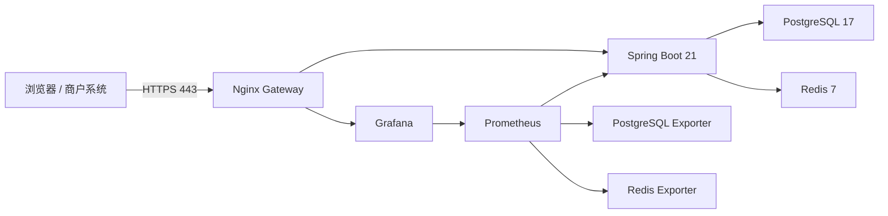

# 支付通知监控 Phase G 实施报告

实施日期：2026-07-17
统一分支：`payment-monitor-phase-g`
统一标签：`payment-monitor-phase-g-v1`
设备协议：`protocolVersion=1`

## 1. 实施结论

Phase G 已完成多商户隔离、商户订单 HMAC API、多设备疑似重复识别、管理端商户上下文、Android 商户信息展示，以及本地生产 Docker、HTTPS、监控、备份、恢复和失败回滚演练。

本阶段保留了默认商户和 Phase A-F 历史数据，没有接入微信、支付宝官方商户 API，也没有直接发布到公网。

## 2. 三端源码

| 端 | 路径 | 分支 |
| --- | --- | --- |
| 服务端 | `D:\desktop\免签app\PaymentMonitorServer` | `payment-monitor-phase-g` |
| 管理端 | `D:\desktop\免签app\PaymentMonitorAdmin` | `payment-monitor-phase-g` |
| Android | `D:\desktop\免签app\PaymentNotificationMonitor` | `payment-monitor-phase-g` |

## 3. 服务端实现

### 3.1 Flyway V8

新增 `V8__payment_phase_g_multi_merchant.sql`，完成：

- 扩展 `pm_merchant`：时区、备注、创建人。
- 新增 `pm_merchant_user`，限制普通后台用户只能绑定一个商户。
- 新增 `pm_merchant_api_key` 和 `pm_merchant_api_credential`。
- `pm_qr_asset` 增加商户内唯一 `asset_code`，历史记录回填为 `QR-{id}`。
- `pm_payment_event` 增加疑似重复状态、关联事件和审核字段。
- 新增支付商户管理员角色、商户管理菜单和疑似重复审核权限。
- 迁移保持向后兼容，历史数据继续归属默认商户。

生产空库实际执行结果为 Flyway `0` 至 `8` 全部成功，共 9 条成功记录。

### 3.2 商户上下文和数据隔离

- 平台超级管理员可以通过 `X-Merchant-Id` 切换商户。
- 超级管理员未传商户 ID 时回落到默认商户。
- 商户管理员固定使用 `pm_merchant_user` 中的绑定商户。
- 商户管理员伪造其他商户 ID 时返回拒绝结果。
- `MerchantContextInterceptor` 在请求开始和结束时清理 ThreadLocal。
- 设备、事件、二维码、订单、Webhook、统计、补单、导出和重复审核均显式带 `merchant_id`。
- 未启用全局 MyBatis 多租户插件，避免设备 API、定时任务和商户 API 发生上下文冲突。

### 3.3 商户订单 HMAC API

已实现：

```text
POST /api/v1/merchant/orders
GET  /api/v1/merchant/orders/{merchantOrderNo}
PUT  /api/v1/merchant/orders/{merchantOrderNo}/cancel
```

请求头：

```text
X-Merchant-Key-Id
X-Credential-Version
X-Timestamp
X-Nonce
X-Signature
```

签名原文：

```text
UPPERCASE_METHOD
REQUEST_PATH
EPOCH_SECONDS
NONCE
LOWERCASE_SHA256_OF_EXACT_BODY
```

实现内容：

- 同商户订单号及相同参数保持幂等。
- 同订单号但参数不同返回 `ORDER_CONFLICT`。
- 不同商户可以使用相同订单号和相同 `assetCode`。
- API Key 支持创建、轮换和撤销，密钥只展示一次。
- 密钥使用主密钥 AES-256-GCM 加密保存。
- Redis 校验 Nonce、时间窗口、密钥版本和限流。
- 商户 API Key 只能访问所属商户。
- 商户订单只能由同商户设备事件匹配。
- Webhook 只投递到订单所属商户的启用端点。

### 3.4 多设备疑似重复

判定规则：

- 商户相同。
- 设备不同。
- 平台、方向、金额和 `rawHash` 相同。
- 接收时间处于 10 秒窗口。

后到事件标记为 `SUSPECTED` 并关联第一条事件，但不会自动删除、拒绝或阻止订单匹配。金额相同但 `rawHash` 不同的连续收款继续作为独立事件保存。

管理端支持：

- 疑似重复筛选。
- 两条事件对比。
- 确认重复。
- 排除重复。
- 记录审核时间、审核人和备注。

### 3.5 支付指标

已增加 Micrometer/Prometheus 支付指标，覆盖：

- 支付事件入库。
- 订单支付。
- 订单匹配延迟。
- Webhook 成功和失败。
- Outbox 积压。
- 在线设备。

## 4. 管理端实现

- 增加商户管理页面。
- 支持创建、修改商户。
- 支持绑定现有后台用户。
- 支持创建、轮换和撤销 API Key。
- 超级管理员导航栏增加全局商户选择器。
- 商户管理员只显示自己的商户名称。
- 请求拦截器自动附加有效的 `X-Merchant-Id`。
- `/payment/merchant-context` 和 `/payment/merchants/list` 不携带旧 Session 中残留的商户 ID。
- 设备、事件、二维码、订单、Webhook 和统计页面随当前商户切换。
- 二维码页面展示并复制 `assetCode`。
- 支付事件页面增加疑似重复筛选、关联信息和审核操作。

## 5. Android 实现

版本：

```text
versionCode=3
versionName=1.2.0-dev
protocolVersion=1
parserVersion=2
```

实现内容：

- 配对响应兼容可选 `merchantCode`、`merchantName`。
- 商户编码和名称进入 Keystore 加密状态存储。
- 同步页展示当前商户信息。
- 解除配对时同步清理商户信息。
- 设备迁移商户仍要求解除配对后使用新商户配对码重新配对。

Debug APK：

```text
D:\desktop\免签app\PaymentNotificationMonitor\app\build\outputs\apk\debug\app-debug.apk
```

SHA-256：

```text
5311E39A8FE457C166742109C8D472ED41D302957C5A3446E9D1D049AE74A511
```

Release Manifest 已验证：

- `usesCleartextTraffic=false`
- 不包含 `DebugFixtureReceiver`

## 6. 生产 Docker 和运维

### 6.1 生产拓扑



生产 Compose 特性：

- 只有 Nginx 暴露 80/443。
- PostgreSQL、Redis、后端、Prometheus 和 Grafana 不暴露宿主机端口。
- HTTP 强制跳转 HTTPS。
- 使用自签证书完成本机演练。
- 增加 HSTS、CSP、`nosniff`、Frame、Referrer 和 Permissions Policy。
- 静态 JS 返回 `application/javascript`，未再出现 HTML MIME 错误。
- Nginx 配置管理 API 和商户 API 限流。
- 生产默认关闭原始通知上传、明文 Webhook 和私网 Webhook。
- 后端和管理端均使用多阶段镜像。
- 后端镜像以 UID `10001` 非 root 用户运行。
- Docker 上下文排除 Git、构建目录、备份、测试产物、证书、环境文件和运行密钥。
- Maven 依赖使用 BuildKit cache mount。

当前生产演练服务：

```text
postgres
redis
backend
gateway
prometheus
grafana
postgres-exporter
redis-exporter
```

8 个服务均已达到 healthy/running。

### 6.2 Prometheus 和 Grafana

- 后端 Actuator 保持 Basic Auth。
- Prometheus 使用独立运行密钥抓取 `/actuator/prometheus`。
- 密钥通过本地忽略文件挂载，不提交 Git。
- `payment-backend`、`postgres`、`redis` 三个 Target 均为 `UP`。
- Grafana `/grafana/api/health` 返回数据库正常。
- 已预置支付监控 Dashboard。

### 6.3 备份和恢复

脚本：

```text
scripts/Backup-Production.ps1
scripts/backup-production.sh
scripts/Test-ProductionRestore.ps1
scripts/test-production-restore.sh
```

策略：

- 保留最近 7 个日备份。
- 保留最近 4 个周备份。
- 使用 PostgreSQL custom dump。
- 备份后执行 `pg_restore --list` 校验。
- 恢复演练使用独立临时数据库，不覆盖当前生产演练库。

2026-07-17 独立恢复演练通过，恢复库最新 Flyway 版本为 `8`。

### 6.4 发布和回滚

`Release-Production.ps1` 固定执行：

1. 配置、证书和运行密钥预检。
2. 当前数据库备份。
3. 保存上一版后端和管理端镜像标签。
4. 构建新镜像。
5. 启动并等待全部服务健康。
6. HTTPS 和 Prometheus 冒烟测试。
7. 失败时恢复上一版镜像并强制重建后端和 gateway。
8. 首次部署不存在完整旧镜像时停止新应用服务，不伪造回滚成功。

已使用 `-SimulateFailureAfterHealth` 完成失败回滚演练，回滚后容器镜像 ID 与发布前镜像 ID 一致，8 个服务恢复健康。

## 7. 测试结果

### 7.1 服务端

```text
Tests: 26
Failures: 0
Errors: 0
```

覆盖：

- 超级管理员默认商户和商户选择。
- 商户管理员绑定和越权拒绝。
- 精确请求体 HMAC。
- 请求体篡改。
- Nonce 重放。
- 时间戳和凭据版本。
- API Key 创建、轮换和撤销。
- 商户订单幂等和冲突。
- 跨设备疑似重复。
- 同金额连续收款保留。

真实 E2E：

- 商户 A/B 相同订单号隔离通过。
- 商户 A/B 相同 `assetCode` 隔离通过。
- HMAC、重放、过期、篡改、轮换、撤销通过。
- 疑似重复和连续收款场景通过。

本地 E2E 结果位于忽略目录：

```text
artifacts/phase-g/merchant-api-e2e.json
artifacts/phase-g/duplicate-e2e.json
```

### 7.2 管理端

```text
pnpm test:payment: 2 passed
pnpm lint: passed
pnpm exec vue-tsc --noEmit: passed
pnpm build:prod: passed
生产 Docker build: passed
```

### 7.3 Android

```text
JVM tests: 15 passed
真实设备 instrumentation tests: 7 passed
Debug build: passed
Release build: passed
AndroidTest build: passed
```

真实测试设备：

```text
serial=f6zh89or49vorgin
model=M2006J10C
Android=12 / API 31
```

真机当前状态：

- 已安装 `versionCode=3`、`versionName=1.2.0-dev`。
- 已配对默认商户。
- 服务地址由本地 `.env.local` 配置，例如 `http://<LAN_IP>:8080`。
- 当前设备 ID 为 `2078023266041090050`。
- 前台监听服务正在运行。
- 系统通知使用权仍包含 `PaymentNotificationListenerService`。

真机 instrumentation 会重新安装测试包。本次测试结束后已重新安装最终 Debug APK、重新配对并恢复监听；手机端本地记录从新的应用数据开始，服务端历史数据未受影响。

## 8. Git 和敏感文件检查

三端均位于 `payment-monitor-phase-g` 分支。

已确认以下内容不会提交：

- `deploy/.env.production`
- 自签证书和私钥
- Prometheus 抓取密码文件
- 数据库备份
- E2E 运行产物
- Android 构建目录和 APK
- Android 原始通知采集文件
- 本地数据库、Keystore 数据和通知原文

三端均执行 `git diff --check`，未发现空白错误；本地生产环境中的实际密钥值未出现在服务端 diff 中。

## 9. CI 模板

三端均增加 GitHub Actions 模板：

- 服务端：Java 21、支付模块测试、生产后端镜像构建。
- 管理端：Node 22、pnpm 测试、lint、类型检查、生产构建和镜像构建。
- Android：Java 17、JVM 测试、Debug/Release 构建。

## 10. 固定边界

本阶段仍不包含：

- 公网正式域名和正式证书签发。
- 微信或支付宝官方商户 API。
- 商户自助注册。
- Webhook 事件类型订阅过滤。
- 企业微信。
- 开机自动监听。
- 多币种结算、退款和对账。

下一阶段可优先处理正式域名/TLS、Webhook 订阅过滤、商户审计日志、API Key 使用审计和生产 CI/CD 发布环境。
